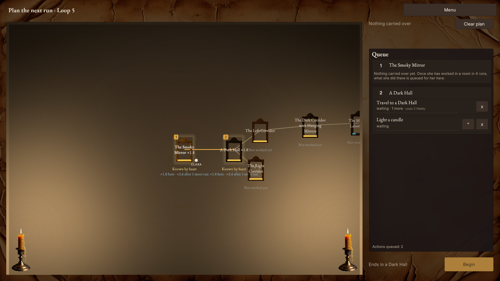

# Hall of Echoing Mirrors

A story-driven incremental loop game for PC (in the line of *Idle Loops* and *Increlution*), made to be played actively, not left idle. It's in development in Unity 6, aimed at a commercial release on Steam.

In 1928, Clara, a practised eromancer (a magician who works with emotion), follows her reflection into the Hall of Echoing Mirrors, where her husband Roland is trapped. Every run ends when her vitality runs out. What she learns, unlocks and masters stays with her, so each attempt gets further.

**Status:** stage 1 of 4, a greybox Act I that can be played from start to finish. See [`docs/BUILD-STATE.md`](docs/BUILD-STATE.md) for exactly what the build does today.

## What's worth a look

| Area | Where | What it shows |
|---|---|---|
| Simulation core | [`Assets/Scripts/Core/`](Assets/Scripts/Core) | All game rules are plain C# with no Unity dependency. A deterministic tick engine means pacing comes from data, never from frame time. Per-run state (`LoopState`) and kept state (`PersistentState`) are separate. |
| Tests | [`Assets/Tests/`](Assets/Tests) | 927 EditMode tests over the core, plus a headless balance probe that plays whole runs to tune the numbers ([`docs/balance-tools.md`](docs/balance-tools.md)). |
| Data-driven content | [`Assets/Data/`](Assets/Data) | Rooms, tasks, items, skills and switches are ScriptableObjects. Balance numbers live in the assets and are edited through an in-editor Balance Sheet. |
| Saves | [`Assets/Scripts/Core/Saving/`](Assets/Scripts/Core/Saving) | Versioned save format with an upgrade step for each version. Saves store content IDs, never names or paths. |
| UI | [`Assets/Scripts/UI/`](Assets/Scripts/UI) | uGUI and TextMeshPro: a route-planning map, a drag-to-reorder action queue, tooltips and a run summary. All player-facing text comes from one keyed text file. |
| Design | [`DesignNotes/`](DesignNotes) | The living GDD, design pillars, balancing formulas and a dated decisions log that records why each call was made. |
| Process | [`docs/plans/`](docs/plans), [`docs/CHANGELOG.md`](docs/CHANGELOG.md), [`docs/CODE-STANDARDS.md`](docs/CODE-STANDARDS.md) | Every feature starts as a written plan with design assumptions, steps, tests and a done-when checklist. |

## How it's made: the agent workflow

I'm the sole developer and designer. **Claude Code wrote the code; I designed the workflow it works inside**:
the architecture, the agent rules, the skills and hooks, the guardrails and the test strategy, and I review
every change. For an agentic-engineering reader, this is the part of the repo worth the most time.

| | |
|---|---|
| Pace | 380+ commits since Sept 23, 2026 (this public copy is a snapshot; day-to-day history is in the private repo) |
| Parallel agents | Three Claude Code agents work at once in separate lanes (features, UI, design), each on its own git branch, worktree and Unity Editor; lanes merge into main periodically |
| Tests | 927 EditMode tests across 89 test files, over 165 game scripts |
| Planned features | 56 written feature plans in [`docs/plans/finished/`](docs/plans/finished), each built test-first and reviewed |
| Agent kit | 11 skills, 5 path-scoped rule files, 2 hooks, a reviewer subagent, and the Unity Editor connected over MCP |

*Because work happens in the lanes and reaches main only when they merge, this snapshot reflects main and can trail the newest lane work.*

**Why it's set up this way.** My first attempt at AI-built games was chat-only "vibe coding" with another model. It
failed: repeated compile errors, weak Unity knowledge, and no way for the AI to check its own work, so every error
came back through me. The lesson, written up in [`docs/ai/WORKFLOW.md`](docs/ai/WORKFLOW.md): *the harness around the
model matters more than the prompt.* The agent needs standing rules, checks it can run itself, and a reviewer that
isn't grading its own homework.

| Failure mode of AI-written code | Countermeasure here |
|---|---|
| Vague prompts produce plausible but wrong features | `/plan-feature` interviews me and writes a plan; a separate build session works from the plan |
| Rules get lost in one long instructions file | Short [`CLAUDE.md`](CLAUDE.md); [`.claude/rules/`](.claude/rules) files load only for the code area being edited |
| Duplicated helpers instead of reuse | "Search before you create" rule; the reviewer checks for duplication first |
| Errors hidden instead of fixed | Hard rule, plus a reviewer check for empty catches and silent skips |
| "Looks done" isn't done | The agent compiles, reads the Unity Console and runs the tests itself over MCP ([`.mcp.json`](.mcp.json)) |
| Tests weakened to make them pass | **Hard rule: tests are never weakened, skipped or deleted to pass** |
| The model grading its own work | [`reviewer`](.claude/agents/reviewer.md) subagent: fresh context, sees only the diff and the rules, 11-point checklist |
| Rule-breaking edits slipping through | [`check-code-rules.py`](.claude/hooks/check-code-rules.py) runs after every edit and sends violations back to the agent |
| Context rot in long sessions | One task per session; parallel lanes in separate git worktrees ([`docs/parallel-lanes.md`](docs/parallel-lanes.md), [`lane-context.py`](.claude/hooks/lane-context.py)) |
| Design drift | Open design questions go to `/design` and the dated decisions log, never settled silently in code |

**Skills** in [`.claude/skills/`](.claude/skills): `plan-feature`, `implement`, `wrap-up` (verify, review, log, commit
message), `code-health`, `refactor`, `balance`, `sync-state`, `workflow`, and role sessions `design`, `writing` and
`ui-work` that load only the docs each role needs.

The art, fonts and AI use are logged with their licences in [`ASSET-LOG.md`](ASSET-LOG.md). This repository is a
public snapshot: day-to-day work happens in a private repo, and the story background from my unpublished novel is
left out here.

## Opening the project

1. Install **Unity 6000.2.15f1** (URP, 2D) through Unity Hub.
2. Open the project folder in Unity Hub (*Add → Add project from disk*).
3. Open `Assets/Scenes/SampleScene.unity` and press Play.
4. To run the tests, use *Window → General → Test Runner → EditMode → Run All*.

## Rights

© Scott Eskridge. All rights reserved. The source is shared for portfolio viewing only. No licence is granted to copy, modify or redistribute it.
